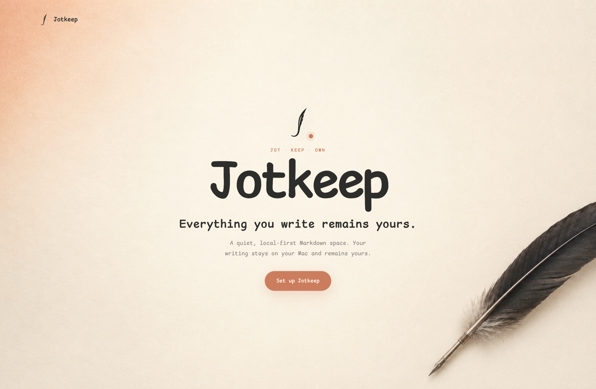

<p align="center">
  <a href="./README.md">简体中文</a> · <strong>English</strong>
</p>

<p align="center">
  
</p>

<p align="center">
  <strong>A quiet, local-first Markdown workspace.</strong><br />
  Your writing stays on your Mac—and stays yours.
</p>

<p align="center">
  
  
  
  <a href="./LICENSE">
    
  </a>
  <a href="https://github.com/Asilencer/jotkeep/actions/workflows/check.yml">
    
  </a>
</p>

<p align="center">
  <a href="#why-jotkeep">Why Jotkeep</a> ·
  <a href="#highlights">Highlights</a> ·
  <a href="#local-development">Local development</a> ·
  <a href="#data-and-boundaries">Data boundaries</a>
</p>

<p align="center">
  
</p>

## Why Jotkeep

Jotkeep does not try to turn writing into another complicated information-management
system. It focuses on a few things that matter:

- **Write directly**: open the app and start writing with Markdown, commands, and
  structured document blocks.
- **Keep it local**: documents are ordinary Markdown files, stored in `~/.jotkeep`
  by default.
- **Own it for the long term**: atomic saves, version history, automatic backups,
  and full exports protect your work.
- **Stay quiet**: no inbox, points, streaks, badges, or productivity scores.

An account is not required, and the cloud is not the default destination for your
content.

## Highlights

### Writing

- Slate block editor and Markdown source mode
- `/` and `、` command menus, tables, columns, code, equations, media, and bookmarks
- Stable undo, redo, drag-and-drop, selection handling, and Markdown round trips
- Left-side document minimap, `⌘K` search, and `⌘N` quick creation

### Organization

- Today, Notes, Articles, Clips, Tasks, Projects, Publish, and Profile
- Project documents grouped by content type; tasks support dates, status, and local
  reminders
- Web content extraction, attachment deduplication, missing-file relinking, and
  library migration
- A personal activity heatmap and recent timeline based on actual local actions

### Protection

- Serialized document writes, synchronized temporary files, and atomic replacement
- External-change conflict detection and recovery copies for damaged JSON
- Up to 50 recent versions per document
- Daily or weekly backups, safe restore, and full library/configuration export

### macOS

- Core Spotlight indexing and `notedown://` deep links
- Share Extension support for web pages, text, images, videos, and files
- Core Location, Open-Meteo weather, and programmatic weather scenes
- Local notifications, native file pickers, and the macOS Trash

### Personalization

- Light, dark, and system themes
- Foreground, background, accent, fonts, type scale, contrast, and sidebar opacity
- Simplified Chinese, English, and system-language modes
- Reduce Motion support and essential keyboard semantics

## Local development

### Requirements

- Apple Silicon Mac
- macOS 26+
- Node.js 22+
- Xcode 26 Command Line Tools

### Run locally

```bash
git clone https://github.com/Asilencer/jotkeep.git
cd jotkeep
npm ci
npm run dev
```

`npm run dev` builds the native Weather, Spotlight, and Share Extension components
before starting Vite and Electron.

### Common commands

| Command | Purpose |
| --- | --- |
| `npm run check` | TypeScript, regression tests, and Electron main-process syntax |
| `npm run build` | Build native components and the Renderer |
| `npm start` | Run the locally built application |
| `npm run package:mac` | Package an Apple Silicon `Jotkeep.app` |

The local application bundle is generated at:

```text
release/Jotkeep-darwin-arm64/Jotkeep.app
```

The current package uses ad-hoc signing and is intended for installation on a
personal Mac. Public distribution still requires Developer ID signing and Apple
notarization.

## Architecture

```text
src/        React UI, Slate editor, themes, and internationalization
electron/   Main process, IPC, file storage, indexing, backups, and system integration
native/     Swift implementations for Weather, Spotlight, and Share Extension
scripts/    Native builds, icon generation, and macOS packaging
tests/      Storage, Markdown, settings, and IPC regression tests
```

The Renderer uses Context Isolation and Sandbox with Node Integration disabled.
File-system and macOS capabilities are exposed through constrained preload and IPC
interfaces.

## Data and boundaries

- The default library is `~/.jotkeep`; Jotkeep never stores user content in the
  source directory.
- Documents are stored as Markdown. Tasks, projects, activity, publish drafts,
  profiles, and other application metadata also remain in the local library.
- Weather requests go to Open-Meteo. Web clipping only accesses URLs explicitly
  submitted by the user.
- Publishing to X uses a Web Intent. Jotkeep does not use X OAuth/API and does not
  claim to read the final publication result.
- There is currently no cloud sync, real-time collaboration, plugin system, or
  automatic updater.
- `.notedown` and `notedown://` are compatibility identifiers; the brand rename does
  not migrate or break existing libraries.

## License

Jotkeep is open source under the [MIT License](./LICENSE). You may use, modify,
distribute, and include it in commercial projects as long as the original copyright
and license notice are preserved.
