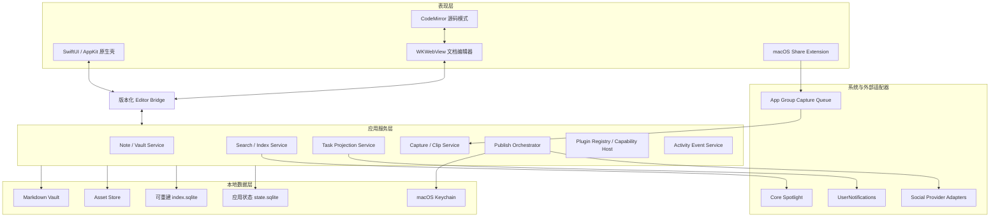
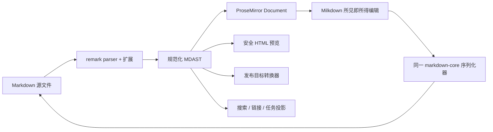

# Note Down：Mac 本地笔记软件调研与架构方案

> 版本：0.4（技术调研存档）
> 日期：2026-07-20
> 产品代号：Note Down，仅用于本文描述，尚未确定正式名称。

> [!IMPORTANT]
> 初版 Daily 纵切的产品结构与页面布局已经废弃。本文旧版产品链路、内容模型、页面布局和
> SwiftUI 主壳内容仅作为调研过程存档，不得作为后续实现要求。新基线不设收件箱，也不设
> 常驻浏览栏；产品信息架构、项目模型、主工作区、Today 天气日历卡和 Electron 主壳建议，以
> [《产品信息架构与页面布局》](./product-information-architecture-and-layout.md) 为准。
> 本文继续保留块编辑器 `/` 菜单、Markdown、插件、安全与本地数据调研。

## 1. 结论先行

这款产品不应被设计成“多个工具拼在一起”，而应围绕一条主链路组织：

> 随时捕获 → 直接归入 Daily、Note、Clip 或 Task → 在 Markdown 文档中发展想法 → 形成作品 → 发布 → 回看长期活动。

建议采用以下技术路线：

- Mac 原生壳：SwiftUI 为主，必要处使用 AppKit。
- 文档编辑器：`WKWebView + TypeScript + Milkdown/ProseMirror`。
- Markdown 源码模式：CodeMirror 6。
- 本地数据：Markdown 文件为笔记真源；SQLite/FTS5 保存索引与应用状态。
- SQLite 访问：GRDB.swift。
- 系统集成：Swift Share Extension、App Groups、Keychain、Core Spotlight、
  `ASWebAuthenticationSession`、UserNotifications。
- 图标：Reicon，但通过应用内部的语义化 `AppIcon` 层按需引入，不在业务代码中散落图标名。
- 第三方文档插件：首版只开放内置插件；公开插件 SDK 后置，并采用权限声明、隔离运行、
  声明式 UI 和能力 RPC，禁止第三方脚本直接进入主应用上下文。

这是一套“原生应用 + Web 文档内核”的混合架构。它保留成熟的 Markdown/ProseMirror 插件生态，
又避免整款 Mac App 在窗口、菜单、分享扩展、沙箱、无障碍和系统服务上长期补原生能力。

### 1.1 当前设计假设

- 单人使用，本地优先，离线时核心功能完整可用。
- 仅支持 macOS，最低系统版本为 macOS 26.0；当前不考虑 Windows、Linux、iOS。
- 第一阶段只在用户自己的 Mac 上安装运行，不进入 Mac App Store，也不面向公众分发。
- 支持用户主动插入的普通笔记链接，但不提供反向链接、未链接提及和关系图谱。
- 用户可选择一个本地 Vault；Markdown 文件与附件可被其他工具直接读取。
- 首版不做多人协作、CRDT、多端同步和端到端加密同步。
- 社交平台发布能力受各平台官方 API、账号权限和审核状态约束；不承诺所有平台都可直接发布。
- 编辑器交互采用 clean-room 方法，只参考可观察的交互模式和扩展契约，不依赖第三方私有代码、资源或内部接口。

## 2. 竞品调研结论

| 产品/资料 | 值得借鉴 | 不应照搬 |
| --- | --- | --- |
| [Reflect](https://reflect.app/) | 快速捕获、Daily Notes、日期流、日历、离线与发布形成闭环 | 网络化笔记与反向链接不是本产品范围；外部日程同步也不进入首版 |
| [Obsidian](https://obsidian.md/help/Files%2Band%2Bfolders/How%2BObsidian%2Bstores%2Bdata) | 本地 Markdown 真源、Vault、可重建缓存、属性、核心/社区插件分层 | 不采用反向链接、未链接提及和关系图谱，也不让插件复杂度过早暴露 |
| [Readwise Reader](https://docs.readwise.io/reader/docs) | 文章、帖子、PDF、视频等统一进入收件箱，再通过 Later/Archive 整理 | 把收藏阅读器做成产品主体；这里的主体仍是个人写作与思考 |
| [Craft](https://support.craft.do/en/plan-and-do) | 任务保留其所在文档的上下文；Daily Note 与快速收件箱结合 | 将块系统变成不透明专有格式 |
| [Capacities](https://docs.capacities.io/reference/use-cases/daily-notes) | Daily Note 是低阻力入口，之后再转化为项目、任务和长文 | 用对象数据库替代用户可直接掌控的 Markdown 文件 |
| [Anytype](https://doc.anytype.io/anytype-docs/getting-started/sets/collections) | 类型、查询视图、手工集合可以共存 | 首版引入完整对象图数据库和复杂 schema |
| [GitHub Profile](https://docs.github.com/en/account-and-profile/reference/profile-contributions-reference) | 活跃热力图与时间线分工清楚，统计口径可解释 | 直接按保存次数或按键次数计数，制造虚假的活跃度 |
| 成熟块编辑器 | 上下文 `/` 菜单、稳定命令 ID、分组、别名搜索、键盘导航、能力懒加载 | 大量办公分组和组织协作组件；个人产品不需要 Jira、OKR、会议等广度 |
| [Reicon](https://reicon.dev/) | 开源 SVG、多框架和 Figma 资源，适合建立一致的图标语言 | 把完整图标库打进应用，或直接用具体图标名表达业务语义 |

### 2.1 由竞品得到的产品原则

1. 捕获入口要少，落点要明确。日常输入写入 Daily，短笔记成为 Note，分享内容成为 Clip，
   无日期任务进入 Anytime；记录时不要求用户先选择项目。
2. “短笔记、长文、设计方案、收藏”共享一个 Note 模型，只用类型、模板、属性和视图区分。
3. 任务是文档中的一等投影：任务中心负责聚合，原文档负责上下文。
4. Markdown 文件是内容真源；数据库主要负责查询、运行状态和不可直接表达在 Markdown 中的应用数据。
5. 热力图和统计只用于回顾，不抢占写作主路径；关系图谱不进入产品范围。
6. 发布不是“导出按钮”，而是一条可预览、可重试、可追踪版本的流水线。

## 3. 块编辑器 `/` 菜单现场分析

### 3.1 观察范围与限制

本次在一个成熟块编辑器页面中做了运行时检查，包括 DOM、交互状态、已加载脚本中的可见标识，
以及打开 `/` 菜单前后的资源加载。结论只代表本次账号、文档和当时版本；菜单会受租户、权限、灰度和已启用插件影响。

检查结束后，文档正文恢复为原来的单个 `/`，菜单已经关闭，页面显示已保存。

### 3.2 可确认的实现特征

- 编辑区根节点是 `contenteditable`，同时带有 `data-slate-editor=true`；正文由带稳定 block ID 的块节点组成。
- 渲染块与隐藏输入/选区缓冲区分离，说明它不是把浏览器 DOM 直接当作唯一文档状态。
- `/` 面板以独立浮层出现；组标题和菜单项都有稳定 `data-name`，当前项通过独立状态类标记。
- 本次面板共观察到 12 个组、74 个项目。组包括基础、常用、按钮、数据、多维表格、绘图、
  团队协作、文档管理、项目管理、进阶、文档小组件和内嵌网页。
- 支持方向键移动、Enter 执行、输入关键词过滤；筛选后只保留有结果的组。
- 搜索并非只匹配可见标题。例如搜索“表格”时，Airtable、看板、甘特图等相关项也进入结果，
  说明命令具有别名或隐藏关键词。
- 主包中能观察到自定义工具箱管理、同步/异步组项目注册、可见性注册、关闭工具箱等模块标识；
  面板类型区分普通块菜单与 Slash Panel。
- 打开菜单后才加载模板、小组件、白板、文件上传和部分第三方块相关资源，说明重能力按需加载。

这里能得出的可靠结论是“注册表 + 上下文筛选 + 搜索索引 + 懒加载”，不能仅凭压缩后的前端包断言其完整后端协议或内部源码结构。

### 3.3 值得采用的部分

- 在空行或行首输入 `/` 打开面板。
- 命令有稳定 ID、标题、说明、图标、分组、关键词、上下文条件和加载器。
- 文字搜索覆盖标题、别名、关键词和最近使用；组只在有结果时出现。
- 全键盘操作、可见选中态、滚动跟随和 Escape 关闭。
- 重型块和第三方能力懒加载；编辑器可交互后再空闲预热高频模块。
- 未授权或当前上下文不可用的命令不出现，而不是点击后再报错。

### 3.4 应该主动删减的部分

首版只保留四组，预计日常菜单项远少于调研对象：

1. **文本**：正文、标题、列表、任务、引用、代码、分隔线、公式。
2. **内容**：链接、笔记链接、图片、文件、表格、高亮块、网页卡片。
3. **知识**：日期、模板、笔记链接、查询视图、收藏卡片。
4. **发布与扩展**：长图、社交卡片和插件动作，仅在上下文适合时显示。

社交账号连接、插件安装、复杂数据视图等管理动作不应塞进 `/` 菜单。

## 4. 产品信息架构

### 4.1 一级导航

| 一级入口 | 核心目标 | 默认内容 |
| --- | --- | --- |
| 今日 | 打开应用后立即记录和行动 | 月历、今日笔记、快速输入、今日任务、最近上下文 |
| 收件箱 | 处理尚未整理的输入 | 随手记、分享内容、链接、图片、待归类任务 |
| 知识库 | 查找和组织长期内容 | 全部笔记、收藏、项目/产品、标签、保存的视图 |
| 任务 | 跨文档聚合行动项 | 收件箱、今天、计划、已完成；每项可回到原文块 |
| 发布 | 将内容变成外部作品 | 草稿、预览、队列、历史、失败重试 |

头像区域承载个人主页、账号管理与设置。全局搜索和命令面板是全局能力，不再占一级导航。

### 4.2 内容模型

所有主要内容统一为 `Note`：

- `fleeting`：随手记、短想法。
- `daily`：每日笔记。
- `article`：长文章。
- `design`：产品设计方案。
- `clip`：文章、帖子、图片、视频等收藏。

“项目/产品”优先做成 Collection：可以是手工集合，也可以是按类型、标签、属性组成的保存查询，
而不是第五套独立存储结构。短笔记可以在不移动原文件的情况下转成长文或归入项目。

### 4.3 主交互框架

- 默认是自适应三栏：导航、列表、编辑器；没有列表上下文时自动变为两栏。
- 编辑器是唯一视觉主角；属性和发布设置按需进入右侧检查器。
- `⌘N` 新建笔记，`⌘K` 命令面板；全局快速记录快捷键由用户自行设置，避免系统冲突。
- 进入 Focus Mode 时只显示编辑器和必要的标题栏。
- 动效只解释空间变化、插入、完成和状态切换；尊重 macOS“减弱动态效果”。
- 颜色以中性背景和单一强调色为主。标签、任务优先使用形状和文字，不只依赖颜色。
- 所有核心操作有键盘路径、清晰焦点和 VoiceOver 标签。

### 4.4 Daily 面板日历

Daily 面板参考 Reflect 将每日笔记作为低阻力入口的思路，但首版只实现本地日期导航，不接入外部日程账号。

- 面板顶部放置紧凑月历，显示月份切换与“回到今天”。
- 日期有四种状态：今天、当前选中、已有 Daily Note、普通日期；已有笔记只用一个克制的圆点标识。
- 点击日期打开 `Daily/YYYY-MM-DD.md`。不存在的日期先展示空白草稿，首次输入时才真正创建文件，避免产生大量空文件。
- 左右方向键在日期间移动，Enter 打开；提供“前一天 / 后一天 / 回到今天”的命令面板动作。
- 主区域保持单日编辑，不在首版实现无限日期流，以免长笔记与任务造成滚动定位混乱。
- Daily Note 以用户当前时区的本地日期为身份；跨时区后不自动改变既有笔记日期。
- 月历不显示第三方会议、节假日日程或复杂热力数据；这些属于独立能力，不能和日期选择器混在一起。

## 5. 完整功能架构

| 模块 | 子能力 | 首版边界 |
| --- | --- | --- |
| 今日 | 月历、日期切换、Daily Note、快速输入、今日任务、最近编辑 | 必做 |
| 收件箱 | 文字、链接、文件、系统分享进入；批量归档/加标签 | 必做 |
| 编辑器 | 所见即所得、源码模式、自动保存、撤销、拖放、查找替换 | 必做 |
| Markdown | CommonMark/GFM、Frontmatter、表格、任务、公式、代码、指令块 | 必做核心子集 |
| 笔记链接 | 主动插入的单向笔记链接、标题/块锚点、失效链接检查 | 必做；不提供反向链接和未链接提及 |
| 属性与视图 | 类型、标签、状态、日期、保存查询、手工集合 | 基础属性和保存查询必做 |
| 搜索 | 全文、标题、标签、属性筛选、最近项、命令搜索 | 必做；语义搜索后置 |
| 任务 | Markdown Checkbox、到期日、优先级、今日/计划/完成聚合 | 必做；重复任务后置 |
| 收藏 | URL、文章正文、帖子元信息、图片、视频链接和缩略图 | URL/Share Extension 首发；浏览器扩展后置 |
| 产品设计 | 模板、状态、版本记录、需求/方案/决策章节 | 通过 Note + Template + Collection 实现 |
| 附件 | 本地图片/文件、去重、引用检查、缺失修复 | 必做 |
| 发布 | 主题、目标预览、文本/线程、长图、发送队列、回执 | 先支持通用导出和 1–2 个目标适配器 |
| 账号 | OAuth、权限范围、连接状态、断开、令牌更新 | 与首批发布适配器同时交付 |
| 个人主页 | 活跃热力图、更新时间线、统计、置顶内容 | 基于事件模型交付，不按按键数统计 |
| 插件 | `/` 命令、块、渲染器、导入导出器、发布器、设置 | 首版只有内置插件；公开 SDK 后置 |
| 设置 | 外观、编辑、文件、快捷键、插件、账号、安全、导入导出 | 必做核心项 |
| 系统集成 | Share Extension、Spotlight、通知、URL Scheme、菜单栏快速记 | Share Extension 必做，其他逐步加入 |
| 数据安全 | 沙箱、备份、恢复、冲突处理、状态导出、崩溃恢复 | 必做 |

## 6. 技术路线比较

| 路线 | 文档/插件生态 | Mac 原生能力 | 体积与资源 | 长期代价 | 结论 |
| --- | --- | --- | --- | --- | --- |
| 纯 SwiftUI/AppKit 编辑器 | 弱，需要自研大量编辑行为 | 最强 | 最好 | 富文本、IME、Markdown round-trip 风险最高 | 不选 |
| Electron + Web UI | 最成熟 | 需要额外 Swift target/桥接 | 最大 | 系统风格、安全面和资源占用需要持续治理 | 不选 |
| Tauri 2 + Web UI | 成熟，Rust 权限模型较好 | 可接入，但 Mac App Extension 需要额外原生工程 | 较好 | UI 原生感和 Apple target 集成仍有成本 | 不选；当前无跨平台计划 |
| **SwiftUI/AppKit + WKWebView 编辑器** | **编辑区复用成熟 Web 生态** | **最强，Share Extension 等自然接入** | **较好** | **维护 Swift/TypeScript 边界，但边界可稳定** | **推荐** |

Apple 将 `WKWebView` 定义为可无缝嵌入原生 UI 的平台原生视图；Share Extension、App Groups、
Keychain、Core Spotlight 和安全作用域文件访问都有直接的原生 API。对一款 Mac-only 产品，这些收益大于
整套跨平台 Web 壳带来的统一技术栈收益。

平台决策已经明确为 macOS 26.0 及以上，且当前不考虑跨平台，因此不再为潜在的 Windows/Linux
迁移引入 Tauri、跨平台 UI 抽象或兼容层。原生壳 + Web 文档内核是当前确定路线。

## 7. 系统架构



### 7.1 分层职责

- **原生壳**：窗口、导航、列表、任务、个人页、设置、系统菜单和无障碍。
- **编辑器**：文档 AST、选区、输入法、block UI、`/` 菜单、Markdown 序列化与渲染。
- **Editor Bridge**：只传结构化消息，不暴露任意 Swift 调用或文件路径。
- **应用服务**：负责用例和事务，不感知具体 SwiftUI View。
- **本地数据层**：文件是内容真源，数据库服务查询和运行状态。
- **适配器**：系统扩展、OAuth、社交发布、网页抽取均与领域模型隔离。

## 8. 本地数据与 Vault

### 8.1 文件布局

```text
Vault/
  Notes/
  Daily/
  Clips/
  Assets/
  Templates/
  .notedown/
    vault.json
```

应用私有目录按 Vault ID 保存：

```text
Application Support/<bundle-id>/vaults/<vault-id>/
  state.sqlite
  index.sqlite
  snapshots/
  plugins/
  cache/
```

- `vault.json` 只放可移植、非敏感的 Vault 级配置和唯一 ID。
- Markdown、附件和模板可以脱离应用读取。
- `index.sqlite` 是纯派生数据，可由 Vault 全量重建。
- `state.sqlite` 保存活动事件、发布队列/回执、账号非敏感信息、插件状态等应用数据。
- OAuth access token、refresh token 和插件密钥只进 Keychain；数据库只保存 Keychain 引用。
- 应提供“导出完整档案”，将 `state.sqlite` 中用户应拥有的数据转换成 JSONL，一并备份。

### 8.2 Note Frontmatter

```yaml
---
id: 019f7d96-750d-7f71-9a02-5d13c7019aa0
type: article
title: 一个产品想法
created_at: 2026-07-20T09:30:00+08:00
updated_at: 2026-07-20T11:10:00+08:00
tags:
  - product
  - notes
status: draft
source:
  url: https://example.com/post
  captured_at: 2026-07-20T10:00:00+08:00
---
```

- `id` 是跨重命名、移动和标题变化的稳定身份。
- 文件名保持人类可读；同名时加短 ID，身份判断不依赖路径。
- 未知 Frontmatter 字段必须原样保留，避免插件停用后丢数据。
- 更新笔记链接时使用 ID 解析目标，再写回可读的相对 Markdown 链接。

### 8.3 主要索引表

`index.sqlite`：

- `notes`：ID、路径、类型、标题、Daily 日期、时间、内容 hash。
- `links`：来源、目标、锚点、链接类型。
- `tasks`：任务 ID、笔记 ID、块锚点、状态、到期日、文本。
- `clips`：来源 URL、内容类型、作者、发布时间、抓取状态。
- `assets`：相对路径、SHA-256、MIME、大小、引用数。
- `search_fts`：标题、正文、标签和属性的 FTS 投影。

`state.sqlite`：

- `activity_events`：不可变事件、发生时间、当时本地日期、对象 ID、元数据。
- `accounts`：平台、账号标签、scope、Keychain 引用、连接状态。
- `publish_jobs`：来源版本、目标、状态、重试和错误分类。
- `publish_receipts`：远端 ID/URL、发布时间、来源内容 hash。
- `plugin_installations`：版本、权限、启用状态和迁移版本。

## 9. Markdown 编辑与渲染方案

### 9.1 单一内容管线



关键约束：

- TypeScript 中只有一个 `markdown-core` 包可以改写 Markdown；编辑、预览、导出和发布共享它。
- Swift 侧可以用 [swift-markdown](https://github.com/swiftlang/swift-markdown) 做只读解析和索引，
  但不能用另一套序列化器重写用户文件。
- Milkdown 本身建立在 ProseMirror 与 remark 之上，适合作为插件驱动的 Markdown WYSIWYG 基础。
- CodeMirror 6 只编辑同一份 Markdown 文本，不维护第二份文档真源。
- WYSIWYG 与源码模式切换必须经过 parse/serialize；解析失败时保留原始源码，不用“修复后”的内容覆盖文件。
- 每种语法都建立 round-trip 金样本：`parse → edit/no-op → serialize` 不得产生语义变化。

### 9.2 支持语法

核心：

- CommonMark、GFM 表格/删除线/任务列表。
- YAML Frontmatter。
- 标题、列表、引用、代码围栏、链接、图片、脚注。
- KaTeX 数学公式、Mermaid 图、Shiki 代码高亮。
- 标准 Markdown 相对链接为持久化格式；输入时可支持 `[[笔记名]]` 快捷语法。

扩展块使用可保留的 directive 语法，例如：

```markdown
:::callout{type="warning"}
这里是一段提醒。
:::
```

插件未启用或版本不兼容时，编辑器显示“未知块”并保留其原始源码，不能删除内容。

### 9.3 安全渲染

- 笔记、收藏和插件内容默认不执行原始 HTML/脚本。
- Markdown → HAST 后统一白名单清洗；外部链接增加安全属性。
- Mermaid、代码、公式和 Embed 由显式 renderer 处理，不允许任意脚本注入主编辑器。
- 收藏网页使用 Mozilla Readability 只做正文抽取；Readability 官方也明确要求对不可信结果继续做 sanitizer，
  因此抽取结果必须清洗并在无脚本环境显示。

## 10. Editor Bridge

Swift 与 TypeScript 只交换版本化消息：

```json
{
  "protocolVersion": 1,
  "requestId": "01J...",
  "documentId": "019...",
  "baseRevision": 42,
  "type": "document.changed",
  "payload": {
    "markdown": "# Title",
    "selection": null
  }
}
```

基础消息：

- Native → Editor：加载文档、设置主题、执行命令、应用外部变更、插入附件结果。
- Editor → Native：内容变更、保存请求、选区变化、打开链接、选择附件、执行应用命令。
- 每次保存携带 `baseRevision` 和内容 hash；发现磁盘外部变更时不得静默覆盖。
- 大附件不经 JSON 传输，只传受控 asset ID；编辑器不能获得任意绝对路径。

## 11. 文档插件系统

### 11.1 两阶段策略

**阶段一：内置插件**

- 与应用一起签名、发布和测试。
- 共享命令注册表、Markdown AST 扩展和权限接口。
- 先验证插件契约是否稳定，再公开 SDK。

**阶段二：第三方插件**

- 插件必须声明权限和贡献点。
- 逻辑运行在隔离 worker、独立 WebView 或 XPC helper 中，通过能力 RPC 访问笔记和网络。
- UI 以声明式组件 schema 为主；不允许把任意 DOM/SwiftUI 代码注入主应用。
- 网络权限精确到域名；文件权限精确到 Vault 内能力，不提供任意路径。
- 安装、升级和权限变化都需要用户确认；支持安全模式和一键禁用全部第三方插件。

### 11.2 Manifest

```json
{
  "id": "com.example.timeline",
  "version": "1.0.0",
  "apiVersion": 1,
  "entry": "dist/plugin.js",
  "permissions": [
    "notes.read",
    "notes.write"
  ],
  "contributes": {
    "slashCommands": [],
    "blocks": [],
    "renderers": [],
    "importers": [],
    "exporters": [],
    "publishers": [],
    "sidePanels": [],
    "settings": []
  }
}
```

### 11.3 Slash Command 注册模型

```ts
interface SlashCommand {
  id: string
  title: string
  description?: string
  icon: AppIconName
  group: "text" | "content" | "knowledge" | "publish"
  keywords: string[]
  when: ContextExpression
  priority: number
  load?: () => Promise<CommandModule>
  run: (context: CommandContext) => Promise<void>
}
```

执行路径：


## 12. 搜索与知识连接

- 先做确定性搜索，不在首版加入向量数据库。
- 元数据过滤走普通索引；正文、标题、标签走 SQLite FTS5。
- FTS5 trigram 适合子串搜索，但 SQLite 官方说明少于 3 个 Unicode 字符的 MATCH 查询不会命中。
  中文 1–2 字查询需要标题/标签前缀索引和受控扫描兜底，不能假设 trigram 已覆盖。
- 查询语法支持 `type:`、`tag:`、`status:`、`before:`、`after:`，普通用户仍可只输入自然关键词。
- 文件监听后增量重建 `notes/links/tasks/search_fts`；提供“重建全部索引”诊断入口。
- `links` 只用于解析用户主动创建的正向链接、跟随跳转、重命名更新和失效检查；不生成反向链接列表，
  也不扫描未链接提及。
- Core Spotlight 只投影用户允许暴露给系统搜索的标题、摘要和 deep link；敏感 Vault 可整体关闭。

## 13. 任务模型

任务内容仍在 Markdown 中：

```markdown
- [ ] 完成发布预览 @due(2026-07-24) #product <!-- id:01J... -->
```

- 可见文本和日期语法保持可读；隐藏 ID 只用于稳定引用和活动事件。
- Task Center 是派生视图。勾选任务时通过 Note Service 回写原 Markdown，再更新索引。
- 在任务中心打开任务时定位到来源笔记与块；不存在“脱离上下文的第二份任务内容”。
- 用户在源码模式删掉隐藏 ID 时不报错；下次索引会创建新 ID，只影响历史关联，不影响正文。

## 14. 收藏与网页抽取

### 14.1 捕获入口

1. 应用内粘贴 URL。
2. macOS Share Extension 接收 URL、文字、图片和文件。
3. 拖放到 Inbox。
4. Safari/浏览器扩展后置，用于需要页面 DOM 的显式捕获。

Share Extension 生命周期短，也不应直接操作用户选定的 Vault。它把标准化 `CaptureEnvelope` 写入 App Group
队列，主应用启动或唤醒后再导入、去重、下载和索引。

### 14.2 内容标准化

统一成：

```text
article | post | image | video | file | generic-link
```

每个收藏至少保留：原 URL、canonical URL、标题、作者、发布时间、捕获时间、平台、内容类型、
原始元信息、正文/摘要、附件引用和抓取状态。

### 14.3 边界

- 公开文章可用 Readability 抽取并转 Markdown；原始 URL 永远保留。
- 帖子和视频优先保存官方 Embed/oEmbed 元信息、缩略图与链接。
- 受登录保护或私人内容默认不后台抓取 cookie；只处理用户通过系统分享明确交付的内容。
- 视频默认不下载原文件；本地保存媒体必须由用户主动开启，并显示存储占用和来源权利提示。
- 抽取失败仍生成可用的 link note，不能让“抓取失败”等同于“收藏失败”。

## 15. 发布与第三方账号

### 15.1 发布流水线

`publish_drafts` 只能由用户在笔记或文章中显式执行“发起发布”创建。文档进入
`Draft / Ready` 状态不会自动出现在发布菜单中；同一来源的未完成草稿优先继续使用。


发布输出类型：

- 纯文本、分段线程。
- 长图/社交卡片：通过隔离的离屏 WKWebView 使用同一设计 token 渲染，再导出图片。
- 静态 HTML/PDF/Markdown。
- 平台原生长文，仅在官方 API 确实支持时开放。

### 15.2 Provider Adapter

每个平台暴露能力矩阵，而不是在 UI 中假定所有平台一致：

```text
maxTextLength
supportsThread
supportsImages
maxImages
supportsVideo
supportsDraft
supportsLongForm
supportsDelete
requiredScopes
```

限制值可能随平台变化，应由适配器版本或远端配置提供，并保留本地安全默认值。不可用时提供
“复制排版结果”“导出长图”“打开官方发布页”等人工交接方案。

### 15.3 账号安全

- OAuth 使用系统浏览器会话 `ASWebAuthenticationSession`。
- 只申请当前功能所需最小 scope。
- token 只存 Keychain；日志、崩溃报告和导出包中必须脱敏。
- 发布前固定 `source_revision`；重试使用 idempotency key/内容 hash，防止重复发送。
- 断开账号时删除 Keychain 项，并明确说明远端授权是否还需用户在平台侧撤销。

## 16. 个人主页与活动模型

热力图不统计按键和每次自动保存，只统计可解释的“有效事件”：

- 创建笔记。
- 一次有实质内容变化的编辑会话。
- 完成任务。
- 保存收藏。
- 发布内容。

`activity_events` 为 append-only。每个事件同时保存 UTC 时间和事件发生时的 `local_day`，避免用户换时区后
历史日期漂移。同一笔记连续编辑在会话窗口内合并为一个事件。用户可以查看统计口径、排除某类事件，
也可以关闭活动记录。

个人主页包括：

- 年度热力图。
- 最近活动时间线。
- 笔记、字数、完成任务、收藏和发布的分项趋势。
- 置顶项目/文章。

所有数据默认只在本机，不自动生成公开主页。

## 17. macOS 系统与安全架构

- Xcode Deployment Target 固定为 macOS 26.0，不保留旧系统兼容分支。
- 第一阶段输出本地 Release `.app`，由用户安装到自己的 `/Applications`；暂不建设 Mac App Store、
  Developer ID 公共分发、Notarization、自动更新和升级服务。
- 即使只在本机使用，主应用、Share Extension 与 App Group 仍需使用一致的签名团队和 entitlement；
  “不公开分发”不等于完全取消代码签名。
- App Sandbox 默认开启；用户通过系统目录选择器选择 Vault。
- 使用 security-scoped bookmark 在重启后恢复对 Vault 的授权。
- 使用 `NSFileCoordinator`/`NSFilePresenter` 协调应用和外部编辑器对文件的读写。
- 保存采用同目录临时文件、协调写入和原子替换；写入前验证 base revision/content hash。
- Share Extension 与主应用通过 App Group 队列交换捕获内容。
- Core Spotlight 建立私有、设备上的搜索投影；用户可以关闭。
- OAuth 凭据和插件 secret 使用 Keychain。
- 内置 Web 内容全部从应用包加载，设置严格 CSP，不依赖 CDN。
- 网络请求按模块区分：收藏抓取、账号 OAuth、发布适配器、插件网络权限分别审计。
- 插件不能直接访问 Keychain、任意文件、Native Bridge 或主编辑器 DOM。

## 18. Reicon 接入方案

- 从 Reicon 原始 SVG 中按需白名单，不把全部 2700+ 图标打入应用。
- 建立业务语义枚举，例如 `noteNew`、`taskComplete`、`publishSend`、`sidebarCollapse`。
- 构建期将同一批 SVG 生成原生 XCAssets/PDF 与编辑器 SVG sprite。
- SwiftUI 和 Web 只依赖语义名、尺寸和 semantic color token。
- 统一 stroke、视觉尺寸、hover/selected/disabled 状态；不在页面内手工改 SVG。
- 在 About/许可证清单保留 Reicon MIT 许可声明。

## 19. 可靠性与验收基线

必须先验证以下失败场景，而不是只验证正常编辑：

1. 保存过程中强制结束应用，Markdown 不损坏，重启能恢复未提交草稿。
2. 删除 `index.sqlite` 后，全量重建所得笔记、链接和任务数量与原索引一致。
3. 外部编辑器修改同一文件时，应用不静默覆盖；能重新加载或进入冲突比较。
4. 禁用某个插件后，其未知 Markdown 指令仍可源码编辑并无损保存。
5. 输入法组合文本、撤销/重做、复制粘贴和超长文档不破坏选区。
6. 断网时写作、搜索、任务、附件和历史浏览仍可用。
7. 断开社交账号后 Keychain 中对应 secret 被删除。
8. 发布回执记录的来源 revision/hash 与预览时一致；重试不会重复发布。
9. 收藏到不可信 HTML 时，脚本、事件属性和危险 URL 无法执行。
10. Reduce Motion、深浅主题、全键盘操作和 VoiceOver 有回归检查。

性能目标应在原型阶段基于真实语料建立，例如 1 万篇笔记、较多附件、中文短查询和超长单文档；
在没有基准测试前，不在方案里虚构具体毫秒指标。

## 20. 交付分期

### 阶段 A：本地知识内核

- 建立 macOS 26.0 原生工程、本地 Release 构建与安装流程。
- Vault、Markdown 真源、附件、原子保存和外部修改检测。
- Today 月历、Daily Note、Inbox、Library、基础任务。
- Milkdown/ProseMirror、源码模式、核心语法和精简 `/` 菜单。
- 标签、属性、单向笔记链接、全文搜索。
- 导入、导出、备份、索引重建和崩溃恢复。

### 阶段 B：捕获与回顾

- macOS Share Extension 与 App Group 队列。
- URL/文章抽取、帖子/图片/视频收藏卡片。
- 活动事件、GitHub 风格热力图和更新时间线。
- Spotlight 和通知。

### 阶段 C：发布闭环

- 统一排版主题、长图与静态导出。
- 账号管理和首批 1–2 个官方 Provider Adapter。
- 逐平台预览、队列、重试、幂等与发布回执。

### 阶段 D：可控扩展

- 公共插件 SDK、权限页、隔离运行时、签名/来源校验和安全模式。
- 浏览器扩展。
- 在明确需求后再评估本地语义搜索、多端同步与端到端加密。

首版明确不做：多人协作、CRDT、在线服务依赖、任意第三方脚本、几十个平台适配、全量视频归档、
关系图谱和未经验证的 AI 功能。

## 21. 产品决策状态

### 21.1 已确认

1. 运行平台只做 macOS。
2. 最低系统版本为 macOS 26.0。
3. 第一阶段只在用户自己的 Mac 上本地安装，不进入 Mac App Store、不做公众分发。
4. 当前不考虑跨平台，因此不为 Windows、Linux、iOS 预留技术兼容层。
5. 不做反向链接、未链接提及和关系图谱，只保留用户主动创建的单向笔记链接。
6. Daily 面板加入紧凑月历，用于打开或创建指定日期的 Daily Note；首版不接入第三方日程。

### 21.2 仍需确认

1. 首批要直接发布的 1–2 个社交平台；必须先核对它们当前官方 API、scope、审核和长文能力。
2. Vault 默认位置：应用容器、Documents，还是首次启动强制用户选择。
3. 收藏媒体默认策略：只存元数据/缩略图，还是允许自动下载图片。
4. 任务日期语法与自定义 directive 是否接受成为产品 Markdown 方言。
5. 活动热力图的统计口径，以及用户是否可以完全关闭事件记录。

## 22. 主要资料

- Reflect：[产品能力](https://reflect.app/)
- Reflect Academy：[Daily Notes 使用方式](https://reflect.academy/how-to-use-reflect)、
  [Calendar and contacts](https://reflect.academy/calendar-and-contacts)
- Obsidian：[本地文件与 Vault](https://obsidian.md/help/Files%2Band%2Bfolders/How%2BObsidian%2Bstores%2Bdata)、
  [Daily Notes](https://obsidian.md/help/plugins/daily-notes)、
  [Slash Commands](https://obsidian.md/help/plugins/slash-commands)、
  [Properties](https://obsidian.md/help/properties)
- GitHub：[Profile contributions reference](https://docs.github.com/en/account-and-profile/reference/profile-contributions-reference)
- Readwise Reader：[Reader 文档](https://docs.readwise.io/reader/docs)、
  [添加内容](https://docs.readwise.io/reader/docs/faqs/adding-new-content)
- Craft：[Plan and Do](https://support.craft.do/en/plan-and-do)
- Capacities：[Daily Notes](https://docs.capacities.io/reference/use-cases/daily-notes)、
  [Offline support](https://docs.capacities.io/misc/offline-support)
- Anytype：[Sets and Collections](https://doc.anytype.io/anytype-docs/getting-started/sets/collections)
- Reicon：[官网](https://reicon.dev/)、[文档](https://reicon.dev/docs)
- Milkdown：[官网](https://milkdown.dev/)、[源码](https://github.com/Milkdown/milkdown)
- CodeMirror：[系统指南](https://codemirror.net/docs/guide/)
- Swift Markdown：[swiftlang/swift-markdown](https://github.com/swiftlang/swift-markdown)
- GRDB：[groue/GRDB.swift](https://github.com/groue/GRDB.swift)
- SQLite：[FTS5](https://www.sqlite.org/fts5.html)
- Mozilla：[Readability](https://github.com/mozilla/readability)
- Apple：[WKWebView](https://developer.apple.com/documentation/webkit/wkwebview)、
  [App Sandbox](https://developer.apple.com/documentation/security/protecting-user-data-with-app-sandbox)、
  [沙箱文件访问](https://developer.apple.com/documentation/security/accessing-files-from-the-macos-app-sandbox)、
  [App Groups](https://developer.apple.com/documentation/BundleResources/Entitlements/com.apple.security.application-groups)、
  [Share Extension](https://developer.apple.com/library/archive/documentation/General/Conceptual/ExtensibilityPG/Share.html)、
  [Keychain](https://developer.apple.com/documentation/security/keychain-services)、
  [ASWebAuthenticationSession](https://developer.apple.com/documentation/authenticationservices/aswebauthenticationsession)、
  [Core Spotlight](https://developer.apple.com/documentation/CoreSpotlight/adding-your-app-s-content-to-spotlight-indexes)、
  [NSFileCoordinator](https://developer.apple.com/documentation/foundation/nsfilecoordinator)
- Tauri（备选路线）：[架构](https://v2.tauri.app/concept/architecture/)、
  [Capabilities](https://v2.tauri.app/security/capabilities/)
